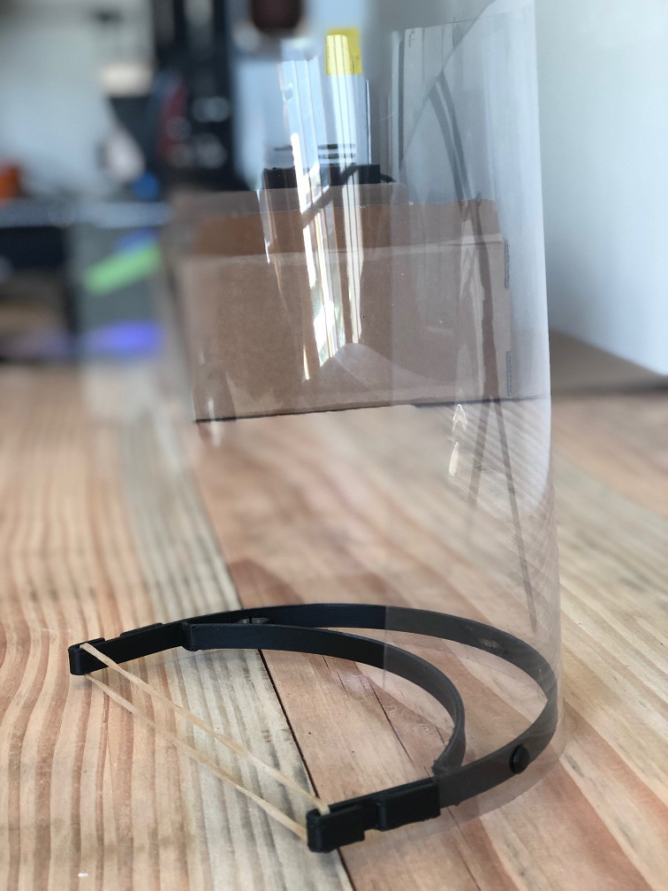

# Overview
Initial model : Shield SARS-CoV-2 - Covid-19 - visieresolidaire (Yann Vodable - FDO) on Thingiverse: https://www.thingiverse.com/thing:4260128
Model created by https://www.thingiverse.com/_Alexis_/about

# Usage

**Materials list**

* Printed parts: 1 part
* Other part: 1 transparent visor (A-4 PETG plastic sheet)

**Printing instructions**

**Assembly instructions**
Needed equipment: *to be completed*

# Contact
* raphael.dessoly@thalesgroup.com

# Disclaimer
These files are provided “AS IS”, in an effort to help with the urgent need for this Item.  
Users of this Item must determine the appropriateness and use of this Item, whether there are any federal or State regulatory requirements for use of this Item, and for informing other users of these responsibilities.

Intended to be worn with PPE.
