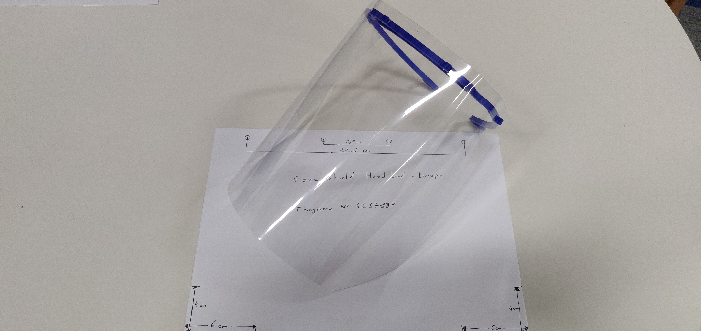
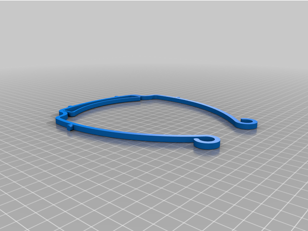
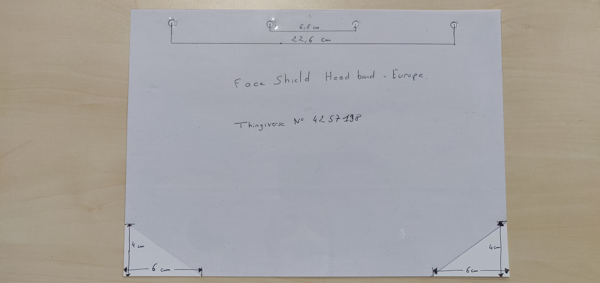

# Overview
Initial model : Face Shield Headband - Europe by FreeFaceShields on Thingiverse: https://www.thingiverse.com/thing:4257198
Model created by  https://www.youmagine.com/designs/protective-visor-by-3dverkstan

# Usage

**Materials list**

* Printed parts: 1 part
* Other part: 1 transparent visor (A-4 PETG plastic sheet)

**Printing instructions**
* Number of prints per build: 1
* Printer type: Tevo Tarantula
* Print parameters:
  * material: PLA
  * nozzle diameter: 0.4mm
  * speed: 
    * External wall speed: 80mm/s
    * Internal wall speed: 100mm/s
    * Top/Bottom printing speed: 45mm/s
  * layer height: 0.3mm
  * Build Time given by Cura : 27min
  * Real build time : 34min

**Assembly instructions**
Needed equipment: a pair of scissors for rounding off corners of the visor

**Packaging**
Prints are immediately bagged after removal from the machine.

# Contact
* yann.mathe@thalesgroup.com

# Disclaimer
These files are provided “AS IS”, in an effort to help with the urgent need for this Item.  
Users of this Item must determine the appropriateness and use of this Item, whether there are any federal or State regulatory requirements for use of this Item, and for informing other users of these responsibilities.

Intended to be worn with PPE.
